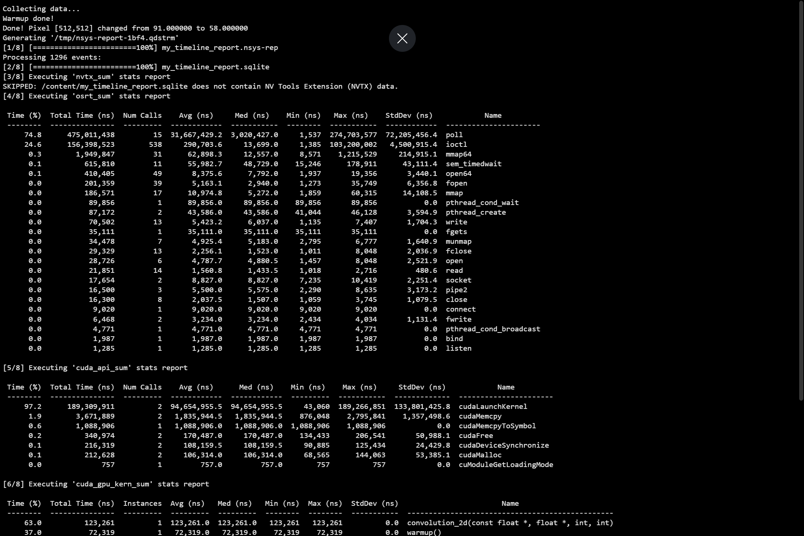

## Day 57 of CUDA:
- Solved 2D Convolution and noted down the report.

- **Report**:
- Kernel time: ~123 µs for 1M elements.
- Host→Device copy: ~0.74 ms (4.19 MB).
- Device→Host copy: ~1.52 ms (4.19 MB).
- **Kernel Launch Overhead**: The cudaMemcpyToSymbol call (sending the filter to Constant Memory) took ~1 ms, which is actually longer than the kernel itself!
- **Observation**: The system is Memory Bound and Overhead Limited due to:
- **Optimization Success**: Using Constant Memory for the filter and Shared Memory Tiles for the pixels was highly effective. The kernel executed in just 123 µs, which is exceptionally fast for a 3×3 neighborhood calculation on 1 million pixels.
- **Transfer Dominance**: The data movement (PCIe) is ~18x slower than the computation.
- **Collaborative Loading**: The logic of loading halos into shared memory worked; even though the math per pixel increased (9 multiplications vs the 4 additions in the Heat Equation), the execution time only increased slightly, proving that shared memory effectively masked the complexity.