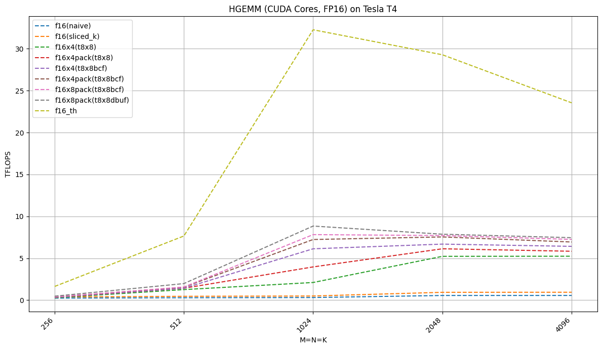

## HGEMM
## 0x00 Explanation

Includes the following：

- [X] hgemm_naive_f16_kernel (naive)
- [X] hgemm_sliced_k_f16_kernel (sliced_k with smem)
- [X] hgemm_t_8x8_sliced_k_f16x4_kernel (thread tile 8x8)
- [X] hgemm_t_8x8_sliced_k_f16x4_bcf_kernel (bank conflicts free)
- [X] hgemm_t_8x8_sliced_k_f16x4_bcf_dbuf_kernel (bank conflicts free, double buffers)
- [X] PyTorch bindings

## Testing

```bash
export TORCH_CUDA_ARCH_LIST=Ada
python3 hgemm.py
```

Output:
```
 ----------------------------------------------------------------------------------------------------------------------------------
                                                       M=256, N=256, K=256
                     out_f16(naive): ['11.546875 ', '1.95117188'], time:0.136649ms, GFLOPS: 245.55  , TFLOPS: 0.25  (+0.00%)
                  out_f16(sliced_k): ['11.546875 ', '1.95117188'], time:0.087296ms, GFLOPS: 384.37  , TFLOPS: 0.38  (+56.53%)
                    out_f16x4(t8x8): ['11.546875 ', '1.95117188'], time:0.116753ms, GFLOPS: 287.40  , TFLOPS: 0.29  
                out_f16x4pack(t8x8): ['11.546875 ', '1.95117188'], time:0.098490ms, GFLOPS: 340.69  , TFLOPS: 0.34  
                 out_f16x4(t8x8bcf): ['11.546875 ', '1.95117188'], time:0.097024ms, GFLOPS: 345.83  , TFLOPS: 0.35  
             out_f16x4pack(t8x8bcf): ['11.546875 ', '1.95117188'], time:0.089645ms, GFLOPS: 374.30  , TFLOPS: 0.37  
             out_f16x8pack(t8x8bcf): ['11.546875 ', '1.95117188'], time:0.088524ms, GFLOPS: 379.04  , TFLOPS: 0.38  
            out_f16x8pack(t8x8dbuf): ['11.546875 ', '1.95117188'], time:0.070595ms, GFLOPS: 475.30  , TFLOPS: 0.48  (+23.66%)
                         out_f16_th: ['11.5078125', '1.97167969'], time:0.020492ms, GFLOPS: 1637.43 , TFLOPS: 1.64  (+244.50%)
----------------------------------------------------------------------------------------------------------------------------------
                                                       M=512, N=512, K=512
                     out_f16(naive): ['15.5859375', '-2.859375 '], time:0.924420ms, GFLOPS: 290.38  , TFLOPS: 0.29  (+0.00%)
                  out_f16(sliced_k): ['15.5859375', '-2.859375 '], time:0.583636ms, GFLOPS: 459.94  , TFLOPS: 0.46  (+58.39%)
                    out_f16x4(t8x8): ['15.5859375', '-2.859375 '], time:0.212740ms, GFLOPS: 1261.80 , TFLOPS: 1.26  (+174.34%)
                out_f16x4pack(t8x8): ['15.5859375', '-2.859375 '], time:0.188446ms, GFLOPS: 1424.47 , TFLOPS: 1.42  (+12.89%)
                 out_f16x4(t8x8bcf): ['15.5859375', '-2.859375 '], time:0.188267ms, GFLOPS: 1425.82 , TFLOPS: 1.43  (+0.09%)
             out_f16x4pack(t8x8bcf): ['15.5859375', '-2.859375 '], time:0.173532ms, GFLOPS: 1546.88 , TFLOPS: 1.55  (+8.49%)
             out_f16x8pack(t8x8bcf): ['15.5859375', '-2.859375 '], time:0.170826ms, GFLOPS: 1571.39 , TFLOPS: 1.57  (+1.58%)
            out_f16x8pack(t8x8dbuf): ['15.5859375', '-2.859375 '], time:0.135707ms, GFLOPS: 1978.04 , TFLOPS: 1.98  (+25.88%)
                         out_f16_th: ['15.625    ', '-2.8652343'], time:0.035059ms, GFLOPS: 7656.58 , TFLOPS: 7.66  (+287.08%)
----------------------------------------------------------------------------------------------------------------------------------
                                                       M=1024, N=1024, K=1024
                     out_f16(naive): ['-14.320312', '-39.25    '], time:6.837463ms, GFLOPS: 314.08  , TFLOPS: 0.31  (+0.00%)
                  out_f16(sliced_k): ['-14.320312', '-39.25    '], time:4.323196ms, GFLOPS: 496.74  , TFLOPS: 0.50  (+58.16%)
                    out_f16x4(t8x8): ['-14.320312', '-39.25    '], time:1.018595ms, GFLOPS: 2108.28 , TFLOPS: 2.11  (+324.43%)
                out_f16x4pack(t8x8): ['-14.320312', '-39.25    '], time:0.541353ms, GFLOPS: 3966.88 , TFLOPS: 3.97  (+88.16%)
                 out_f16x4(t8x8bcf): ['-14.320312', '-39.25    '], time:0.350332ms, GFLOPS: 6129.85 , TFLOPS: 6.13  (+54.53%)
             out_f16x4pack(t8x8bcf): ['-14.320312', '-39.25    '], time:0.296711ms, GFLOPS: 7237.60 , TFLOPS: 7.24  (+18.07%)
             out_f16x8pack(t8x8bcf): ['-14.320312', '-39.25    '], time:0.274610ms, GFLOPS: 7820.11 , TFLOPS: 7.82  (+8.05%)
            out_f16x8pack(t8x8dbuf): ['-14.320312', '-39.25    '], time:0.242877ms, GFLOPS: 8841.86 , TFLOPS: 8.84  (+13.07%)
                         out_f16_th: ['-14.28125 ', '-39.125   '], time:0.066566ms, GFLOPS: 32260.74, TFLOPS: 32.26 (+264.86%)
----------------------------------------------------------------------------------------------------------------------------------
                                                       M=2048, N=2048, K=2048
                     out_f16(naive): ['51.65625  ', '-12.664062'], time:30.71551ms, GFLOPS: 559.32  , TFLOPS: 0.56  (+0.00%)
                  out_f16(sliced_k): ['51.65625  ', '-12.664062'], time:18.36066ms, GFLOPS: 935.69  , TFLOPS: 0.94  (+67.29%)
                    out_f16x4(t8x8): ['51.65625  ', '-12.664062'], time:3.285932ms, GFLOPS: 5228.31 , TFLOPS: 5.23  (+458.77%)
                out_f16x4pack(t8x8): ['51.65625  ', '-12.664062'], time:2.802491ms, GFLOPS: 6130.21 , TFLOPS: 6.13  (+17.25%)
                 out_f16x4(t8x8bcf): ['51.65625  ', '-12.664062'], time:2.569055ms, GFLOPS: 6687.23 , TFLOPS: 6.69  (+9.09%)
             out_f16x4pack(t8x8bcf): ['51.65625  ', '-12.664062'], time:2.277350ms, GFLOPS: 7543.80 , TFLOPS: 7.54  (+12.81%)
             out_f16x8pack(t8x8bcf): ['51.65625  ', '-12.664062'], time:2.228951ms, GFLOPS: 7707.60 , TFLOPS: 7.71  (+2.17%)
            out_f16x8pack(t8x8dbuf): ['51.65625  ', '-12.664062'], time:2.183294ms, GFLOPS: 7868.78 , TFLOPS: 7.87  (+2.09%)
                         out_f16_th: ['51.8125   ', '-12.273437'], time:0.586748ms, GFLOPS: 29279.80, TFLOPS: 29.28 (+272.10%)
----------------------------------------------------------------------------------------------------------------------------------
                                                       M=4096, N=4096, K=4096
                     out_f16(naive): ['76.375    ', '4.41015625'], time:244.7712ms, GFLOPS: 561.50  , TFLOPS: 0.56  (+0.00%)
                  out_f16(sliced_k): ['76.375    ', '4.41015625'], time:145.4286ms, GFLOPS: 945.06  , TFLOPS: 0.95  (+68.31%)
                    out_f16x4(t8x8): ['76.375    ', '4.41015625'], time:26.21526ms, GFLOPS: 5242.71 , TFLOPS: 5.24  (+454.75%)
                out_f16x4pack(t8x8): ['76.375    ', '4.41015625'], time:23.55771ms, GFLOPS: 5834.14 , TFLOPS: 5.83  (+11.28%)
                 out_f16x4(t8x8bcf): ['76.375    ', '4.41015625'], time:21.40822ms, GFLOPS: 6419.91 , TFLOPS: 6.42  (+10.04%)
             out_f16x4pack(t8x8bcf): ['76.375    ', '4.41015625'], time:19.80569ms, GFLOPS: 6939.37 , TFLOPS: 6.94  (+8.09%)
             out_f16x8pack(t8x8bcf): ['76.375    ', '4.41015625'], time:18.95818ms, GFLOPS: 7249.58 , TFLOPS: 7.25  (+4.47%)
            out_f16x8pack(t8x8dbuf): ['76.375    ', '4.41015625'], time:18.43931ms, GFLOPS: 7453.58 , TFLOPS: 7.45  (+2.81%)
                         out_f16_th: ['76.1875   ', '4.8828125 '], time:5.836868ms, GFLOPS: 23546.69, TFLOPS: 23.55 (+215.91%)
```
