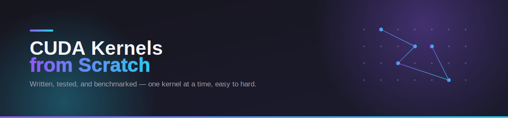

# [LeetCUDA](https://github.com/xlite-dev/LeetCUDA.git) 

  Hand-written CUDA kernels, ordered easy → hard. Each one implemented and validated against a reference implementation.

---

## Kernels

| Kernel | Description | Difficulty |
|--------|--------------|:----------:|
| [`elementwise`](./kernels/elementwise) | Generic element-wise operation template (add/mul/etc.) applied across an array | ⭐ |
| [`relu`](./kernels/relu) | Rectified Linear Unit — `f(x) = max(0, x)` | ⭐ |
| [`sigmoid`](./kernels/sigmoid) | Logistic function — `f(x) = 1 / (1 + e⁻ˣ)` | ⭐ |
| [`elu`](./kernels/elu) | Exponential Linear Unit — smooth negative saturation for x < 0 | ⭐⭐ |
| [`gelu`](./kernels/gelu) | Gaussian Error Linear Unit — smooth, tanh-approximated activation used in transformers | ⭐⭐ |
| [`swish`](./kernels/swish) | Self-gated activation — `f(x) = x · sigmoid(x)` | ⭐⭐ |
| [`hardswish`](./kernels/hardswish) | Piecewise-linear, hardware-friendly approximation of Swish | ⭐⭐ |
| [`embedding`](./embedding) | Lookup-table gather kernel — maps token indices to embedding vectors | ⭐⭐ |
| [`dot_product`](./kernels/dot_product) | Two-vector reduction — `Σ Aᵢ · Bᵢ`, using shared memory | ⭐⭐ |
| [`reduce`](./kernels/reduce) | Generic parallel reduction (sum/max/min) with tree reduction + warp shuffle | ⭐⭐ |
| [`histogram`](./kernels/histogram) | Binned counting kernel using atomic operations | ⭐⭐ |
| [`mat_transpose`](./kernels/mat_transpose) | Tiled matrix transpose — coalesced access, bank-conflict-free shared memory | ⭐⭐ |
| [`layer_norm`](./kernels/layer_norm) | Layer Normalization — per-row mean/variance + affine transform | ⭐⭐ |
| [`rms_norm`](./kernels/rms_norm) | Root-Mean-Square Normalization (LLaMA-style, no mean subtraction) | ⭐⭐ |
| [`softmax`](./kernels/softmax) | Numerically-stable softmax with max-subtraction trick | ⭐⭐ |
| [`rope`](./kernels/rope) | Rotary Positional Embedding — rotates query/key vectors by position-dependent angles | ⭐⭐⭐ |

---