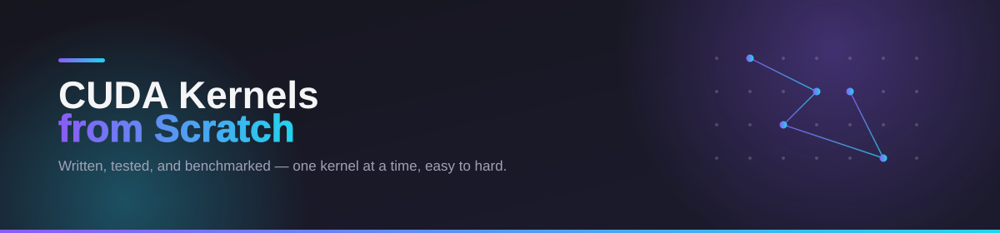

# [LeetCUDA](https://github.com/xlite-dev/LeetCUDA.git) 

  Hand-written CUDA kernels, ordered easy → hard. Each one implemented and validated against a reference implementation.

- [X] Ampere[A100] Architecture 
- [X] Hopper[H100] Architecture
- [X] Inside Nvidia GPU's blog [Link](https://www.aleksagordic.com/blog/matmul)
- [x] GPU ISA (Registers, Load and cache, Floating point, Integer, Bit-wise and logical operations, Warp level & uniform level op)
    - [P](https://zhuanlan.zhihu.com/p/686198447)
    - [R](https://zhuanlan.zhihu.com/p/688616037)
    - [L&C](https://zhuanlan.zhihu.com/p/692445145)
    - [FP](https://zhuanlan.zhihu.com/p/695667044)
    - [IO](https://zhuanlan.zhihu.com/p/700921948)
    - [BLO](https://zhuanlan.zhihu.com/p/712356884)
    - [WUO](https://zhuanlan.zhihu.com/p/712357647)

- [x] Hopper TMA (Tensor Memory Accelerator): Hardware-driven 1D–5D tensor transfers bypassing warp registers.
- [x] Warpgroup MMA (WGMMA): Async matrix multiply instructions executed at the Warpgroup (128 threads) level instead of Warp (32 threads) level.
- [x] Distributed Shared Memory (DSMEM): Direct cluster-wide SM-to-SM shared memory access.
- [x] FP8 / NVFP4 & Quantization: Transformer Engine internals, FP8 E4M3 vs E5M2 scaling factors, W8A8/W4A16 GEMM kernels.

- [x] PTX in-line and SASS  [l](https://github.com/JINO-ROHIT/kernels/tree/main/ptx), [l][https://zhuanlan.zhihu.com/p/660630414], [l](https://zhuanlan.zhihu.com/p/659741469)

- [x] Tensor Cores
    - [x] Nvidia Tensor core Introduction [l](https://zhuanlan.zhihu.com/p/620185229)
    - [x] WMMA-API programming intro [l](https://zhuanlan.zhihu.com/p/620766588) , [l](https://jino-rohit.github.io/blogs/04_wmma.html)
    - [x] MMA-API programming intro [l](https://zhuanlan.zhihu.com/p/621855199)
    - [x] WMMA vs MMA
    - [x] Asynchronous Pipeline
    - [x] Swizzle

- [x] HGEMM MMA & WMMA cuda kernels implementation
- [x] SGEMM MMA & WMMA cuda kernels implementation
- [x] (SGEMM , HGEMM) double buffer kernels vs cp.async (asyncronus pipelining) . Compare and differentiate logic
- [x] Flash Attention Implementation (Naive) [l](https://gordicaleksa.medium.com/eli5-flash-attention-5c44017022ad)

- [x] [LLM Inference Optimization](https://www.aleksagordic.com/blog/vllm)
    - [x] GQA/YOCO/CLA/MLKV: Sharing KV Cache Between Layers [l](https://zhuanlan.zhihu.com/p/697311739)
    - [x] Automatic Prefix Caching [l](https://zhuanlan.zhihu.com/p/693556044)
    - [x] From Online-Softmax to FlashAttention V1/V2/V3 [l](https://zhuanlan.zhihu.com/p/668888063)
    - [x] FlashDecoding / FlashDecoding++ [l](https://zhuanlan.zhihu.com/p/696075602)
    - [x] TensorRT MHA/Myelin vs FlashAttention-2 [l](https://zhuanlan.zhihu.com/p/678873216)

- [x] TensorRT- LLM [l](https://zhuanlan.zhihu.com/p/662361469), [l](https://zhuanlan.zhihu.com/p/699333691)
- [x] vLLM
    - [x] vLLM Operator Development Process [l](https://zhuanlan.zhihu.com/p/1892966682634473987)
    - [x] vLLM + DeepSeek-R1 671B Multi-Machine Deployment and Bug Fixing Notes [l](https://zhuanlan.zhihu.com/p/29950052712)

- [x] CuTe
- [x] CUTLASS
- [x] torch.compile [l](https://zhuanlan.zhihu.com/p/9418379234)
    - [x] TorchDynamo [l](https://zhuanlan.zhihu.com/p/9640728231)
    - [x] AOTAutograd [l](https://zhuanlan.zhihu.com/p/9997263922)
    - [x] TorchInductor [l](https://zhuanlan.zhihu.com/p/11224299472)
    - [x] Operator Fusion [l](https://zhuanlan.zhihu.com/p/21053905491)
    - [x] torch.compile Usage Guide [l](https://zhuanlan.zhihu.com/p/12712224407)
    - [x] Understanding TorchDynamo Principles [l](https://zhuanlan.zhihu.com/p/630933479)

- [x] NCCL & Collective Operations: AllReduce, AllGather, ReduceScatter, P2P communication.
- [x] Parallelism Strategies: Tensor Parallelism (TP), Pipeline Parallelism (PP), Sequence Parallelism (SP), and Context Parallelism (CP).
- [x] MoE (Mixture of Experts): Top-K routing, Token Dropping, and All-to-All communication optimizations.
- [x] Networking: NVLink / NVSwitch bandwidth bounds, InfiniBand vs RoCE v2, GPUDirect RDMA.
---

## Kernels

| Kernel | Description | Difficulty |
|--------|--------------|:----------:|
| [`elementwise`](./kernels/elementwise) | Generic element-wise operation template (add/mul/etc.) applied across an array | ⭐ |
| [`relu`](./kernels/relu) | Rectified Linear Unit — `f(x) = max(0, x)` | ⭐ |
| [`sigmoid`](./kernels/sigmoid) | Logistic function — `f(x) = 1 / (1 + e⁻ˣ)` | ⭐ |
| [`elu`](./kernels/elu) | Exponential Linear Unit — smooth negative saturation for x < 0 | ⭐⭐ |
| [`gelu`](./kernels/gelu) | Gaussian Error Linear Unit — smooth, tanh-approximated activation used in transformers | ⭐⭐ |
| [`swish`](./kernels/swish) | Self-gated activation — `f(x) = x · sigmoid(x)` | ⭐⭐ |
| [`hardswish`](./kernels/hardswish) | Piecewise-linear, hardware-friendly approximation of Swish | ⭐⭐ |
| [`embedding`](./embedding) | Lookup-table gather kernel — maps token indices to embedding vectors | ⭐⭐ |
| [`dot_product`](./kernels/dot_product) | Two-vector reduction — `Σ Aᵢ · Bᵢ`, using shared memory | ⭐⭐ |
| [`reduce`](./kernels/reduce) | Generic parallel reduction (sum/max/min) with tree reduction + warp shuffle | ⭐⭐ |
| [`histogram`](./kernels/histogram) | Binned counting kernel using atomic operations | ⭐⭐ |
| [`mat_transpose`](./kernels/mat_transpose) | Tiled matrix transpose — coalesced access, bank-conflict-free shared memory | ⭐⭐ |
| [`layer_norm`](./kernels/layer_norm) | Layer Normalization — per-row mean/variance + affine transform | ⭐⭐ |
| [`rms_norm`](./kernels/rms_norm) | Root-Mean-Square Normalization (LLaMA-style, no mean subtraction) | ⭐⭐ |
| [`softmax`](./kernels/softmax) | Numerically-stable softmax with max-subtraction trick | ⭐⭐ |
| [`rope`](./kernels/rope) | Rotary Positional Embedding — rotates query/key vectors by position-dependent angles | ⭐⭐⭐ |

---