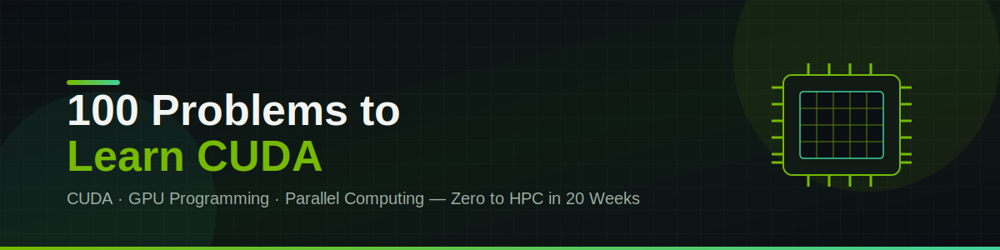

# 🚀 100 Problems to Become an HPC Engineer

**A structured, problem-by-problem path from "Hello World" CUDA kernels to production-grade GPU code.**

This repo is a self-paced curriculum for learning GPU programming with CUDA — starting from environment setup and ending with real domain applications in deep learning, scientific computing, and HPC. It's built for beginners with basic C/C++ knowledge who want a guided, hands-on route into GPU computing.

> 💡 **Format**: Every problem lists the operation, expected time, key learning objective, and (where relevant) test cases or profiling targets — so you always know *why* you're solving it, not just *what*.

---

## 📊 Progress Tracker

| Level | Topic | Problems | Status |
|:-----:|-------|:--------:|:------:|
| 0 | Setup & Foundations | 3 | ✅ Completed |
| 1 | Map Pattern (Element-wise Ops) | 18 | ✅ Completed |
| 2 | Reductions | 12 | ✅ Completed |
| 3 | Memory Patterns | 11 | ✅ Completed |
| 4 | Scan Pattern (Prefix Sums) | 10 | ✅ Completed |
| 5 | Stencil Pattern | 10 | ✅ Completed |
| 6 | Advanced Patterns | 13 | ✅ Completed |
| 7 | Optimization Masterclass | 14 | ✅ Completed |
| 8 | Production-Quality Code | 10 | ✅ Completed |
| 9 | Domain Applications | 10 | ✅ Completed |
| **Total** | | **111** | **✅ All levels completed** |

---

## 🧰 Prerequisites

- C/C++ fundamentals (pointers, arrays, structs)
- A CUDA-capable NVIDIA GPU (check the [CUDA GPU compatibility list](https://developer.nvidia.com/cuda-gpus))
- Basic command line / git familiarity

### Environment Setup (Level 0)

- [x] Install the [CUDA Toolkit](https://developer.nvidia.com/cuda-toolkit)
- [x] Verify install with `deviceQuery` (included in CUDA samples)
- [x] Install [Nsight Systems](https://developer.nvidia.com/nsight-systems) — timeline profiling
- [x] Install [Nsight Compute](https://developer.nvidia.com/nsight-compute) — kernel-level profiling
- [x] Set up version control (`git`)

---

## 📚 Table of Contents

- [Level 0 — Setup & Foundations](#level-0--setup--foundations-week-1)
- [Level 1 — Map Pattern](#level-1--map-pattern-element-wise-operations-week-2-3)
- [Level 2 — Reductions](#level-2--reductions-combining-data-week-4-5)
- [Level 3 — Memory Patterns](#level-3--memory-patterns-week-6-7)
- [Level 4 — Scan Pattern](#level-4--scan-pattern-prefix-sums-week-8-9)
- [Level 5 — Stencil Pattern](#level-5--stencil-pattern-neighbor-access-week-10-11)
- [Level 6 — Advanced Patterns](#level-6--advanced-patterns-week-12-14)
- [Level 7 — Optimization Masterclass](#level-7--optimization-masterclass-week-15-16)
- [Level 8 — Production-Quality Code](#level-8--production-quality-code-week-17-18)
- [Level 9 — Domain Applications](#level-9--domain-applications-week-19-20)
- [Recommended Resources](#-recommended-resources)

---

## Level 0 — Setup & Foundations (Week 1)
**Goal:** Get your environment working and understand the basics.

| # | Problem | Learn | Time |
|---|---------|-------|------|
| [x] 0.1 | Hello from GPU — print from each thread | Kernel launch, thread indexing | 15 min |
| [x] 0.2 | Thread Index Explorer — print `blockIdx`, `threadIdx`, global idx for first 32 threads | Thread hierarchy, indexing | 20 min |
| [x] 0.3 | Memory Copy Test — copy array host ↔ device | `cudaMemcpy`, allocation/deallocation | 30 min |

📖 Reference: [CUDA C++ Programming Guide — Kernels & Thread Hierarchy](https://docs.nvidia.com/cuda/cuda-c-programming-guide/index.html#kernels)

---

## Level 1 — Map Pattern: Element-wise Operations (Week 2-3)
**Goal:** Master the simplest parallel pattern — independent per-element operations.

### L1.1 — Basic Arithmetic
| # | Problem | Operation | Time |
|---|---------|-----------|------|
| [x] 1.1 | Vector Addition | `C[i] = A[i] + B[i]` | 1 hr |
| [x] 1.2 | Vector Subtraction | `C[i] = A[i] - B[i]` | 30 min |
| [x] 1.3 | Vector Scaling (SAXPY variant) | `B[i] = alpha * A[i]` | 30 min |
| [x] 1.4 | SAXPY | `Y[i] = alpha * X[i] + Y[i]` | 45 min |
| [x] 1.5 | Vector Multiply | `C[i] = A[i] * B[i]` | 20 min |
| [x] 1.6 | Vector Divide | `C[i] = A[i] / B[i]` (handle ÷0) | 30 min |
| [x] 1.7 | Polynomial Evaluation | `Y[i] = a·X[i]³ + b·X[i]² + c·X[i] + d` | 45 min |
| [x] 1.8 | Vector Magnitude | `B[i] = sqrt(A[i].x² + A[i].y²)` (float2) | 1 hr |

### L1.2 — Mathematical Functions
| # | Problem | Operation | Time |
|---|---------|-----------|------|
| [x] 1.9 | Element-wise Absolute Value | `B[i] = |A[i]|` | 20 min |
| [x] 1.10 | Element-wise Square | `B[i] = A[i]²` | 20 min |
| [x] 1.11 | Element-wise Square Root | `B[i] = sqrt(A[i])` | 30 min |
| [x] 1.12 | Element-wise Exponential | `B[i] = exp(A[i])` | 30 min |
| [x] 1.13 | Element-wise Logarithm | `B[i] = log(A[i])` (handle log(0)/negative) | 30 min |
| [x] 1.14 | Sigmoid Function | `B[i] = 1 / (1 + exp(-A[i]))` | 45 min |

### L1.3 — Comparisons and Masks
| # | Problem | Operation | Time |
|---|---------|-----------|------|
| [x] 1.15 | Element-wise Maximum | `C[i] = max(A[i], B[i])` | 30 min |
| [x] 1.16 | Element-wise Minimum | `C[i] = min(A[i], B[i])` | 30 min |
| [x] 1.17 | Threshold Mask | `B[i] = (A[i] > t) ? 1 : 0` | 45 min |
| [x] 1.18 | Clamp Values | `B[i] = clamp(A[i], min, max)` | 45 min |

💡 Bonus for 1.4 & 1.7-series ops: compare against [cuBLAS SAXPY](https://docs.nvidia.com/cuda/cublas/index.html#cublas-t-axpy).

---

## Level 2 — Reductions: Combining Data (Week 4-5)
**Goal:** Learn to combine many inputs into one output.

### L2.1 — Basic Reductions
| # | Problem | Time | Key Learning |
|---|---------|------|---------------|
| [x] 2.1 | Sum Reduction (Single Block, N ≤ 1024) | 2 hr | Shared memory, tree reduction, `__syncthreads()` |
| [x] 2.2 | Sum Reduction (Multi-Block, N = 1M) | 3 hr | Multi-phase reduction, partial sums |
| [x] 2.3 | Maximum Reduction | 1.5 hr | Adapting sum-reduction pattern |
| [x] 2.4 | Minimum Reduction | 1 hr | — |
| [x] 2.5 | Maximum with Index | 2 hr | Reducing compound types (value + index) |
| [x] 2.6 | Count Non-Zero Elements | 1.5 hr | Conditional reduction |
| [x] 2.7 | Dot Product | 1.5 hr | Two-array reduction (compare with [cuBLAS dot](https://docs.nvidia.com/cuda/cublas/index.html#cublas-t-dot)) |
| [x] 2.8 | L2 Norm | 1.5 hr | `sqrt(Σ A[i]²)` |

> **Sum Reduction (2.1) checklist:** CPU reference → naive global-memory GPU (slow) → tree reduction in shared memory → validate at each step.

### L2.2 — Advanced Reductions
| # | Problem | Time | Key Learning |
|---|---------|------|---------------|
| [x] 2.9 | Mean and Variance | 2 hr | Two-pass algorithm |
| [x] 2.10 | Histogram (Simple, 10 bins) | 2.5 hr | Atomic operations, race conditions |
| [x] 2.11 | Reduce by Key (Simple) | 3 hr | Conditional reduction, key-value pairs |
| [x] 2.12 | Warp-Level Reduction | 2 hr | `__shfl_down_sync`, warp primitives |

---

## Level 3 — Memory Patterns (Week 6-7)
**Goal:** Master the GPU memory hierarchy.

### L3.1 — Coalescing and Access Patterns
| # | Problem | Time | Key Learning |
|---|---------|------|---------------|
| [x] 3.1 | Transpose (Naive) | 2 hr | Memory coalescing issues |
| [x] 3.2 | Transpose (Tiled, Shared Memory) | 3 hr | Tiling, bank conflicts — target 5-10× speedup |
| [x] 3.3 | Strided Access Analysis | 1.5 hr | Impact of non-coalesced access |
| [x] 3.4 | Array of Structures vs Structure of Arrays | 2.5 hr | Data layout impact (SoA should win) |
| [x] 3.5 | Constant Memory Test | 2 hr | When to use constant memory |

### L3.2 — Shared Memory Deep Dive
| # | Problem | Time | Key Learning |
|---|---------|------|---------------|
| [x] 3.6 | Shared Memory Bank Conflicts | 2 hr | What causes conflicts, how to avoid them |
| [x] 3.7 | Shared Memory Padding | 1.5 hr | Padding to eliminate bank conflicts |
| [x] 3.8 | 1D Convolution with Shared Memory | 3 hr | Halo cells, memory reuse |
| [x] 3.9 | Shared Memory Double Buffering | 3 hr | Pipelining loads with compute |
| [x] 3.10 | Matrix Multiply (Naive) | 2 hr | Triple nested loop, no data reuse |
| [x] 3.11 | Matrix Multiply (Tiled, Shared Memory) | 4 hr | **The** classic optimization — 10-50× speedup, compare with [cuBLAS GEMM](https://docs.nvidia.com/cuda/cublas/index.html#cublas-t-gemm) |

---

## Level 4 — Scan Pattern: Prefix Sums (Week 8-9)
**Goal:** Master the hardest of the classic parallel patterns.

### L4.1 — Prefix Sum Progression
| # | Problem | Time | Key Learning |
|---|---------|------|---------------|
| [x] 4.1 | Inclusive Scan (Hillis-Steele, Single Block) | 3 hr | `[1,2,3,4,5] → [1,3,6,10,15]` |
| [x] 4.2 | Prefix Sum (Blelloch, Single Block) | 4 hr | Work-efficient scan: up-sweep / down-sweep |
| [x] 4.3 | Prefix Sum (Multi-Block, N = 1M) | 4 hr | Three-phase scan: block scans → scan of sums → add offsets |
| [x] 4.4 | Exclusive Scan | 2 hr | `[1,2,3,4,5] → [0,1,3,6,10]` |
| [x] 4.5 | Segmented Scan | 3 hr | Reset accumulation at segment flags |
| [x] 4.6 | Scan with Comparison (Running Max) | 2.5 hr | Scan with an arbitrary operator |

### L4.2 — Scan Applications
| # | Problem | Time | Key Learning |
|---|---------|------|---------------|
| [x] 4.7 | Stream Compaction | 3 hr | Mask → scan → scatter |
| [x] 4.8 | Sparse to Dense | 2.5 hr | Extract non-zero values + indices |
| [x] 4.9 | Partition (Quicksort Helper) | 3 hr | Dual-scan technique |
| [x] 4.10 | Run-Length Encoding | 3 hr | Compress repeated values |

---

## Level 5 — Stencil Pattern: Neighbor Access (Week 10-11)
**Goal:** Handle operations that depend on neighboring data.

### L5.1 — 1D Stencils
| # | Problem | Time | Key Learning |
|---|---------|------|---------------|
| [x] 5.1 | Box Filter (1D) | 2 hr | Basic stencil, boundary handling (clamp/reflect/zero) |
| [x] 5.2 | Gaussian Blur (1D) | 2.5 hr | Weighted stencil `[1,2,4,2,1]/10` |
| [x] 5.3 | 1D Heat Equation | 2 hr | Numerical PDE simulation |
| [x] 5.4 | 1D Wave Equation | 3 hr | Time-stepping with two time levels |

### L5.2 — 2D Stencils
| # | Problem | Time | Key Learning |
|---|---------|------|---------------|
| [x] 5.5 | 2D Box Filter | 3 hr | 2D indexing, shared memory tiling |
| [x] 5.6 | 2D Convolution (Separable) | 3 hr | Separable filter optimization |
| [x] 5.7 | Sobel Edge Detection | 3 hr | Image gradients — computer vision |
| [x] 5.8 | 2D Laplacian | 2 hr | Second-derivative operator, image sharpening |
| [x] 5.9 | 2D Heat Equation | 4 hr | 2D numerical PDE, diffusion |
| [x] 5.10 | Game of Life | 4 hr | Cellular automaton, complex boundaries |

---

## Level 6 — Advanced Patterns (Week 12-14)
**Goal:** Combine patterns to handle complex, real-world scenarios.

### L6.1 — Multi-Kernel Algorithms
| # | Problem | Time | Key Learning |
|---|---------|------|---------------|
| [x] 6.1 | Radix Sort (1 bit) | 4 hr | Count → scan → scatter |
| [x] 6.2 | Radix Sort (Complete) | 6 hr | Extend to all bits, compare with [Thrust sort](https://docs.nvidia.com/cuda/thrust/index.html) |
| [x] 6.3 | Merge Sort (Bitonic) | 5 hr | Compare-exchange networks |
| [x] 6.4 | K-Means Clustering | 6 hr | Iterative GPU algorithm: distances → assignment → reduce-by-key |
| [x] 6.5 | Connected Components (BFS) | 8 hr | Graph algorithms on GPU |

### L6.2 — Atomics and Synchronization
| # | Problem | Time | Key Learning |
|---|---------|------|---------------|
| [x] 6.6 | Atomic Histogram (256 bins) | 3 hr | Global vs shared atomics vs privatization |
| [x] 6.7 | Atomic Operations Comparison | 2 hr | `atomicAdd/Min/Max/CAS` — when to use which |
| [x] 6.8 | Lock-Free Queue | 4 hr | Advanced synchronization |
| [x] 6.9 | Reduction with Atomics | 2 hr | Tree reduction vs atomics — tradeoffs |

### L6.3 — Sparse and Irregular Data
| # | Problem | Time | Key Learning |
|---|---------|------|---------------|
| [x] 6.10 | SpMV (COO format) | 4 hr | Irregular access patterns |
| [x] 6.11 | SpMV (CSR format) | 4 hr | Compare with [cuSPARSE](https://docs.nvidia.com/cuda/cusparse/index.html) |
| [x] 6.12 | Graph Traversal (Adjacency List) | 5 hr | Irregular parallelism |
| [x] 6.13 | Triangular Solve (Sparse) | 5 hr | Dependency handling |

---

## Level 7 — Optimization Masterclass (Week 15-16)
**Goal:** Push performance to the limit.

### L7.1 — Memory Optimization Deep Dive
| # | Problem | Time | Key Learning |
|---|---------|------|---------------|
| [x] 7.1 | Cache Blocking Study | 3 hr | L1/L2 cache optimization across tile sizes |
| [x] 7.2 | Texture Memory Example | 3 hr | Hardware-accelerated interpolation |
| [x] 7.3 | Unified Memory Performance | 2 hr | When unified memory helps/hurts |
| [x] 7.4 | Pinned Memory Transfers | 2 hr | Pageable vs pinned H↔D transfer speed |
| [x] 7.5 | Zero-Copy Memory | 2 hr | Mapped memory use cases |

### L7.2 — Compute Optimization
| # | Problem | Time | Key Learning |
|---|---------|------|---------------|
| [x] 7.6 | Fast Math Study | 2 hr | `-use_fast_math` precision/speed tradeoff |
| [x] 7.7 | FMA (Fused Multiply-Add) | 2 hr | Peak compute throughput |
| [x] 7.8 | Loop Unrolling | 3 hr | Manual vs `#pragma unroll` |
| [x] 7.9 | Register Pressure Tuning | 3 hr | `-maxrregcount`, registers vs occupancy |
| [x] 7.10 | Warp Divergence Mitigation | 3 hr | Rewriting branchy code |

### L7.3 — Advanced Launch Configuration
| # | Problem | Time | Key Learning |
|---|---------|------|---------------|
| [x] 7.11 | Occupancy Calculator | 2 hr | Theoretical occupancy analysis |
| [x] 7.12 | Block Size Tuning | 3 hr | Systematic tuning across kernels |
| [x] 7.13 | Grid-Stride Loop Performance | 2 hr | Direct indexing vs grid-stride loops |
| [x] 7.14 | Persistent Threads | 4 hr | Keeping threads alive across iterations |

---

## Level 8 — Production-Quality Code (Week 17-18)
**Goal:** Write code that others can actually use.

### L8.1 — Software Engineering
| # | Problem | Time | Key Learning |
|---|---------|------|---------------|
| [x] 8.1 | Error Handling Framework | 3 hr | `CUDA_CHECK` macro, file/line reporting, cleanup |
| [x] 8.2 | Template Kernel Library | 4 hr | Generic `reduce<T, Op>()` — C++ templates with CUDA |
| [x] 8.3 | API Design | 4 hr | Header/implementation separation for a vector-ops library |
| [x] 8.4 | Performance Benchmarking Suite | 4 hr | Multi-size timing infrastructure, CSV output |
| [x] 8.5 | Unit Testing Framework | 4 hr | Automated correctness testing |

### L8.2 — Streams and Concurrency
| # | Problem | Time | Key Learning |
|---|---------|------|---------------|
| [x] 8.6 | Basic Streams | 3 hr | `cudaStream_t`, asynchronous execution |
| [x] 8.7 | Overlapping Compute and Copy | 4 hr | Hiding transfer latency |
| [x] 8.8 | Multi-Stream Data Processing | 4 hr | Practical chunked streaming |
| [x] 8.9 | Stream Callbacks | 3 hr | `cudaStreamAddCallback` |
| [x] 8.10 | Multi-GPU (Peer-to-Peer) | 5 hr | Data sharing across GPUs |

---

## Level 9 — Domain Applications (Week 19-20)
**Goal:** Apply everything to real-world problems.

### L9.1 — Deep Learning Primitives
| # | Problem | Time | Key Learning |
|---|---------|------|---------------|
| [x] 9.1 | GEMM Optimization | 8 hr | Goal: within 2× of [cuBLAS](https://docs.nvidia.com/cuda/cublas/index.html) — everything you've learned |
| [x] 9.2 | Batch Normalization | 4 hr | `out = (in - mean) / sqrt(var + eps)` |
| [x] 9.3 | ReLU & Activation Functions | 3 hr | Element-wise nonlinearities |
| [x] 9.4 | 2D Convolution (Im2Col) | 6 hr | Convert convolution to matmul |
| [x] 9.5 | Softmax | 4 hr | Numerically stable — reduction + map pattern |

### L9.2 — Scientific Computing
| # | Problem | Time | Key Learning |
|---|---------|------|---------------|
| [x] 9.6 | 2D Poisson Solver (Jacobi) | 5 hr | Iterative PDE solver |
| [x] 9.7 | FFT (Cooley-Tukey) | 8 hr | Compare with [cuFFT](https://docs.nvidia.com/cuda/cufft/index.html) |
| [x] 9.8 | N-Body Simulation | 6 hr | All-pairs gravitational interactions |
| [x] 9.9 | Monte Carlo Pi Estimation | 3 hr | Random sampling with [cuRAND](https://docs.nvidia.com/cuda/curand/index.html) |
| [x] 9.10 | Molecular Dynamics (Simple) | 8 hr | Particle simulation with forces |

---

## 📖 Recommended Resources

**Official documentation**
- [CUDA C++ Programming Guide](https://docs.nvidia.com/cuda/cuda-c-programming-guide/index.html)
- [CUDA C++ Best Practices Guide](https://docs.nvidia.com/cuda/cuda-c-best-practices-guide/index.html)
- [Nsight Systems Docs](https://docs.nvidia.com/nsight-systems/) · [Nsight Compute Docs](https://docs.nvidia.com/nsight-compute/)

**Libraries to benchmark against**
- [cuBLAS](https://docs.nvidia.com/cuda/cublas/index.html) — dense linear algebra
- [cuSPARSE](https://docs.nvidia.com/cuda/cusparse/index.html) — sparse linear algebra
- [cuFFT](https://docs.nvidia.com/cuda/cufft/index.html) — Fast Fourier Transform
- [cuRAND](https://docs.nvidia.com/cuda/curand/index.html) — random number generation
- [Thrust](https://docs.nvidia.com/cuda/thrust/index.html) — parallel algorithms (sort, scan, reduce)

**Books**
- *Programming Massively Parallel Processors* — Kirk & Hwu
- *CUDA by Example* — Sanders & Kandrot
- *Professional CUDA C Programming* — Cheng, Grossman & McKercher

---

## 🤝 Contributing

Found a bug in a test case, or want to add a problem? PRs and issues are welcome — this is meant to be a living resource for the GPU-programming community.

## 📄 License

This curriculum is shared for educational purposes. Feel free to fork, adapt, and use it for your own learning path.

---

<i>111 problems. 20 weeks. Zero to HPC engineer.</i>
