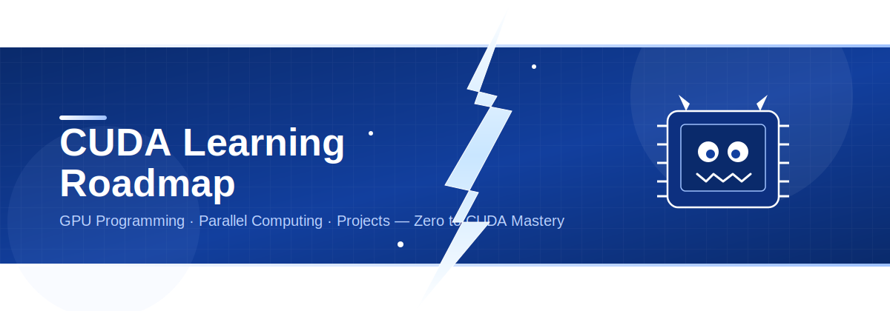

# CUDA

This is my CUDA learning roadmap where I’ll be documenting my daily progress, key learnings, resources, and code snippets as I work toward mastering CUDA.

## ⭐ Star History

<a href="https://www.star-history.com/?repos=Ajith-Kumar-Nelliparthi%2FLearning_CUDA_From_Scratch&type=date&legend=top-left">
 <picture>
   <source media="(prefers-color-scheme: dark)" srcset="https://api.star-history.com/chart?repos=Ajith-Kumar-Nelliparthi/Learning_CUDA_From_Scratch&type=date&theme=dark&legend=top-left&sealed_token=iTdaGQhDK7vOzkd-Pn1l4hf6PIgsw26jlhEVYCqAClV53oAhdytFNSW_F5olLU8GSoGu-ToUTTZCR77L6RLQhvAK8dEgXpTbZ32ieY9iAYkoCK7pP2n_JUy67te27fCImbj-QNj4sE55w8bUWgR5aTqE7bTCaCw2NHJ7bZVUyE7710yC5OcLzkyyAgVZ" />
   <source media="(prefers-color-scheme: light)" srcset="https://api.star-history.com/chart?repos=Ajith-Kumar-Nelliparthi/Learning_CUDA_From_Scratch&type=date&legend=top-left&sealed_token=iTdaGQhDK7vOzkd-Pn1l4hf6PIgsw26jlhEVYCqAClV53oAhdytFNSW_F5olLU8GSoGu-ToUTTZCR77L6RLQhvAK8dEgXpTbZ32ieY9iAYkoCK7pP2n_JUy67te27fCImbj-QNj4sE55w8bUWgR5aTqE7bTCaCw2NHJ7bZVUyE7710yC5OcLzkyyAgVZ" />
   
 </picture>
</a>